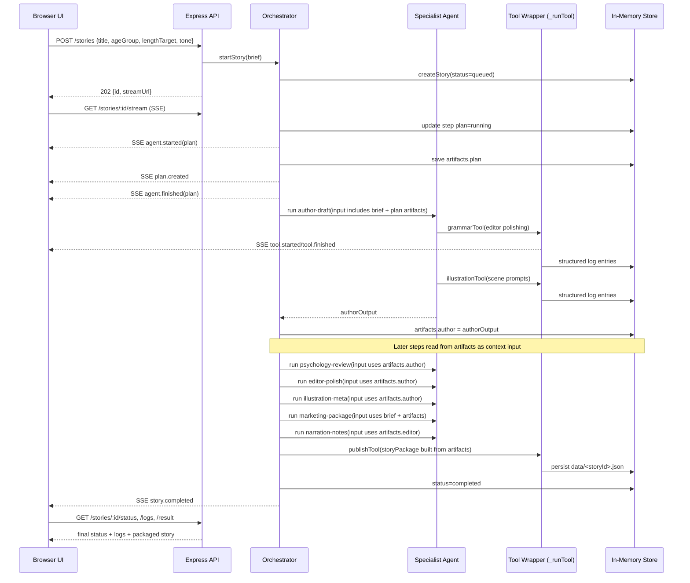

# Children Story Agents (Node.js + Express)

A prototype multi-agent children's story studio using Express and an `@openai/agents`-ready wrapper.

## Expert agents included

1. Children's Author / Storyteller
2. Child Development / Educational Consultant
3. Editor / Copy Editor
4. Illustrator / Art Director
5. Marketing / Publisher Advisor
6. Narration / Voice Coach (optional)

## Features

- Orchestrator pipeline with step dispatch and per-step state
- Specialist agents with role prompts, tool access, and short memory
- Tools: `researchTool`, `grammarTool`, `illustrationTool`, `publishTool`
- Structured logs for every agent and tool call
- SSE live stream for progress updates
- UI with timeline, live logs, retry/rerun/cancel controls
- In-memory storage + JSON persistence under `data/`

## How the code works

### 1) Request lifecycle (high level)

1. Client calls `POST /stories` with `{ title, ageGroup, lengthTarget, tone }`.
2. `server.js` validates input and calls `orchestrator.startStory(...)`.
3. `lib/orchestrator.js` creates a story record in `lib/store.js` and starts the pipeline.
4. Each pipeline step updates status (`queued` → `running` → `succeeded/failed`) and emits SSE events.
5. UI subscribes to `GET /stories/:id/stream` and renders live progress/logs.
6. Final result is packaged and persisted by `publishTool` to `data/<storyId>.json`.

### 2) Orchestrator step pipeline

The orchestrator executes these steps in order:

- `plan` (build world, characters, plot beats)
- `author-draft`
- `psychology-review`
- `editor-polish`
- `illustration-meta`
- `marketing-package`
- `narration-notes`
- `publish`

Each step is wrapped by `_executeStep(...)`, which:

- logs `agent.started`
- runs the step with timeout (`STEP_TIMEOUT_MS`)
- logs `agent.finished` or `agent.failed`
- emits matching SSE events

### 3) How Tools are called

All tool calls are funneled through orchestrator method `_runTool(...)`.

That wrapper does all of the following for every tool call:

1. acquires semaphore (concurrency limit per story)
2. emits `tool.started`
3. writes structured log with `status: running`
4. executes the tool function (`researchTool`, `grammarTool`, `illustrationTool`, `publishTool`)
5. emits `tool.finished` (or `tool.failed`)
6. writes structured completion/failure log with duration and output summary
7. releases semaphore

So tools are not called directly from routes; they are called through the orchestrator’s tracked execution path.

### 4) How tool responses enter the "context window"

In this project, the "context window" is the step input object passed into each agent run (not a hidden chat buffer).

Data flows like this:

1. A tool returns a structured object.
2. The owning agent includes that result in its own output.
3. Orchestrator stores that output under `story.artifacts`.
4. Later steps build their input from `story.artifacts`, so prior tool results become part of the next agent context.

Concrete examples:

- Author step generates tone-aligned scene drafts and stores them in `artifacts.author`.
- Psychology and Editor steps read from `artifacts.author.sceneDrafts`.
- Illustration step reads author scenes and writes illustration metadata to `artifacts.illustrations`.
- Publish step merges all artifacts into final story package.

For OpenAI mode, each agent call receives a JSON payload as input via `lib/openaiAgentClient.js`, which means the accumulated artifact data is explicitly present in the model input for that step.

### 5) Logging/observability model

Each log item includes fields like:

- `timestamp`
- `storyId`
- `agent`
- `step`
- `tool`
- `input`
- `outputSummary`
- `durationMs`
- `status`

These logs are available in:

- Story-scoped endpoint: `GET /stories/:id/logs`
- Admin endpoint: `GET /admin/logs`
- Live SSE stream: `GET /stories/:id/stream`

### 6) Sequence diagram (request → tools → context → UI)



## Install

```bash
npm install
```

Environment variables are loaded automatically from `.env` using `dotenv`.

Example `.env`:

```bash
AGENT_MODE=openai
OPENAI_API_KEY=your_key_here
OPENAI_MODEL=gpt-4.1-mini
AGENT_TIMEOUT_MS=20000
STEP_TIMEOUT_MS=30000
OPENAI_ALLOW_MOCK_FALLBACK=true
```

## Run

```bash
npm start
```

Open: http://localhost:3000

## Dev

```bash
npm run dev
```

## Test

```bash
npm test
```

## API

### `POST /stories`

Start a story generation job.

Example body:

```json
{
  "title": "Tim the Flying Dog",
  "ageGroup": 7,
  "lengthTarget": 1000,
  "tone": "playful, encouraging, slightly adventurous"
}
```

Sample cURL:

```bash
curl -X POST http://localhost:3000/stories \
  -H "Content-Type: application/json" \
  -d '{
    "title":"Tim the Flying Dog",
    "ageGroup":7,
    "lengthTarget":1000,
    "tone":"playful, encouraging, slightly adventurous"
  }'
```

Response:

```json
{
  "id": "<story-id>",
  "streamUrl": "/stories/<story-id>/stream"
}
```

### `GET /stories/:id/status`

Returns job status and per-step statuses.

### `GET /stories/:id/logs?page=1&pageSize=200`

Returns historical logs for a story.

### `GET /stories/:id/result`

Returns final packaged story once completed.

### `GET /stories/:id/stream`

SSE stream with live events:

- `plan.created`
- `agent.started`
- `tool.started`
- `tool.finished`
- `agent.finished`
- `story.completed` / `story.failed`

### `POST /stories/:id/cancel`

Requests cancellation.

### `POST /stories/:id/steps/:stepId/retry`

Retries a failed step and reruns downstream steps.

### `POST /stories/:id/steps/:stepId/rerun`

Reruns any step and invalidates downstream results.

### `GET /admin/logs?storyId=<id>`

Returns structured logs globally or filtered by story.

### `GET /admin/mode`

Returns current runtime agent mode and whether `OPENAI_API_KEY` is present.

### `POST /admin/mode`

Sets runtime agent mode.

Example body:

```json
{
  "mode": "mock"
}
```

The UI includes an "Agent Mode" menu to switch modes without restarting the server.

## OpenAI integration notes

- `AGENT_MODE=mock` (default): runs deterministic local mock behavior and does not require an API key.
- `AGENT_MODE=openai`: requires `OPENAI_API_KEY`; if key is missing, agent execution fails fast.
- `OPENAI_MODEL` (optional): chooses the model for OpenAI mode (default: `gpt-4.1-mini`).
- `OPENAI_ALLOW_MOCK_FALLBACK` (default `true`): when `true`, OpenAI mode runs `@openai/agents` first, then falls back to schema-safe mock output if the model response is not parseable JSON.
- Set `OPENAI_ALLOW_MOCK_FALLBACK=false` for strict mode (fail-fast on non-JSON or SDK errors).
- To use real SDK mode, install package support:

```bash
npm install @openai/agents
```

- The wrapper at `lib/openaiAgentClient.js` centralizes SDK calls so API-shape updates are isolated.

## Suggested file layout

- `server.js`
- `lib/orchestrator.js`
- `lib/agents/*`
- `lib/tools/*`
- `lib/store.js`
- `lib/logger.js`
- `ui/*`
- `tests/orchestrator.test.js`
